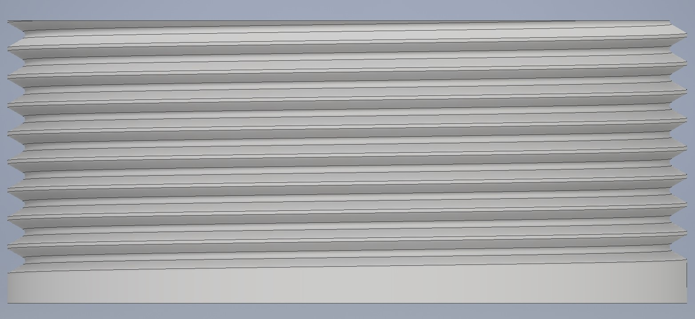
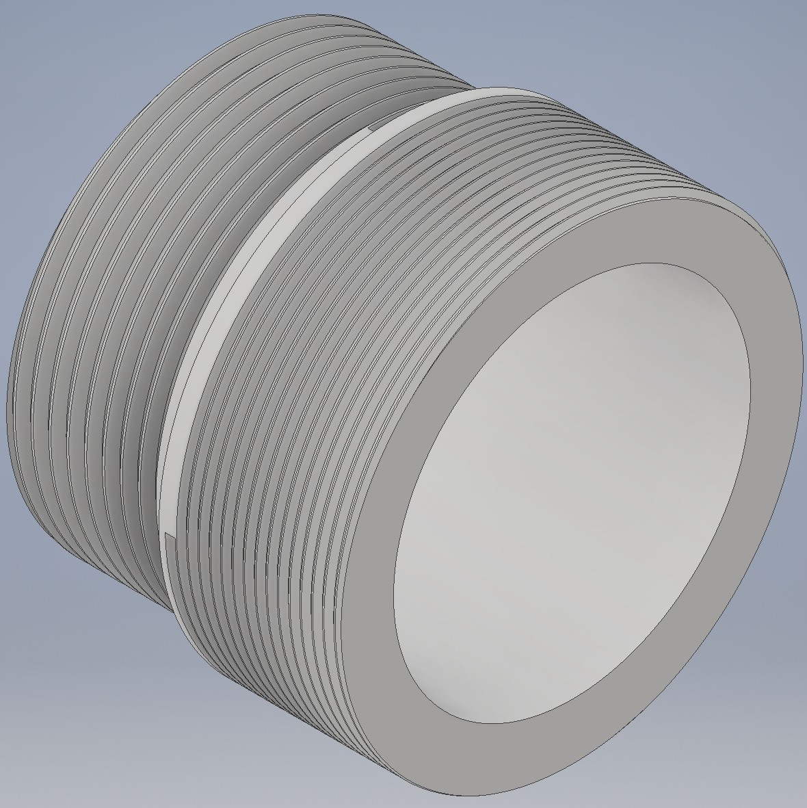

Sometimes machining threaded adapters could be difficult:
You don't have a machine workshop available nearby, or
The queue for machining jobs is too long, or
The machine shop does not have the desired tapping tool.

With enough resolution you should be able to 3D print your own threads and adapters.

The single threads were done following https://www.youtube.com/watch?v=5tdDkYQxrew. I like this video because of its simplicity, clarity and ease of modifying the thread, which is based on the pitch value alone. Of course you might also have to change the diameter of the extruded cylinder. You don't have to watch this video if you are already familiar with making threads, just download and edit the part files on your own.

The video already explains how to make an imperial thread. I used 1.035''-40.

I found formulas for the thread shape of the metric standard in http://www.metrication.com/engineering/threads.html. I used M24x1.

The single-thread files feature external threads. Internal threads can be easily done by constraining the sketch of the coiled V shape to the inner surface of the hollow cylinder.

BiThread is the name of the file containing the adapter. I forgot the word "adapter" and so ended up calling it this way.

